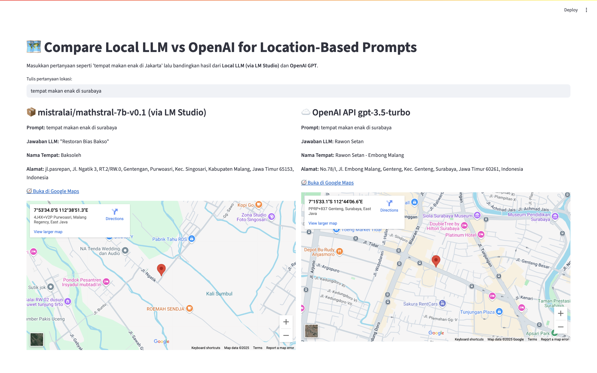

# 🗺️ LLM Maps API

This project is a lightweight travel assistant powered by a **local LLM (via LM Studio)**, **OpenAI API** and the **Google Maps API**. It provides an API and a simple web UI to answer questions like:

> "Where to eat in Bandung?"  
> "Best coffee shop in Jakarta?"  
> "Tempat wisata alam di Jogja?"

---

## 📸 Preview


---

## 🔧 Features

- 🧠 Uses local LLM mathstral-7b-v0.1 via LM Studio to interpret natural language queries
- ☁️ Supports OpenAI gpt-3.5-turbo as optional comparison
- 📍 Extracts and searches place info using **Google Places API (New)**
- 🗺️ Displays embedded map and external link to Google Maps
- ⚡ Built with **FastAPI** and **Streamlit** (no frontend JS needed)
- 🔀 Compare responses from both LLM sources side by side

---

## 📦 Tech Stack

- Python 3.10+
- FastAPI
- Streamlit
- LM Studio (for local LLM server)
- Google Maps Places API (New)
- dotenv + requests

---

## 🚀 Getting Started

### 1. Clone this repo

```bash
git clone https://github.com/bimosyah/llm-maps-api.git
cd llm-maps-api
```

### 2. Set up a Python virtual environment
```bash
python -m venv venv
source venv/bin/activate  # macOS/Linux
# venv\Scripts\activate   # Windows
```

### 3. Install dependencies
```bash
pip install -r requirements.txt
```

### 4. Enable required Google Maps APIs
Make sure your Google Cloud project has the following enabled: <br>
✅ Places API (New) <br>
✅ Maps Embed API
Then create an API key at:
```bash
https://console.cloud.google.com/apis/credentials
```
Restrict it to API: <br> 
- Places API 
- Maps Embed API


### 5. Configure environment variables
Create a .env file in the root directory:
```bash
GOOGLE_MAPS_API_KEY=your_google_maps_api_key_here
OPENAI_API_KEY=your_openai_api_key_here
LLM_ENDPOINT=http://localhost:1234/v1
```

### 6. Start the backend API (FastAPI)
```bash
uvicorn app:app --reload
```
### 7. Start the frontend UI (Streamlit)
In a new terminal (with the same virtualenv activated):
```bash
streamlit run ui.py
```
This will launch a browser window with the user-friendly interface.

### 8. Test example propts
Try some of these:
- Best food in Jakarta 
- Tempat kopi enak di Malang 
- Wisata alam di Bandung 
- Top-rated seafood restaurant in Surabaya

You’ll get LLM-generated place name , Google Maps location (embedded + link)

